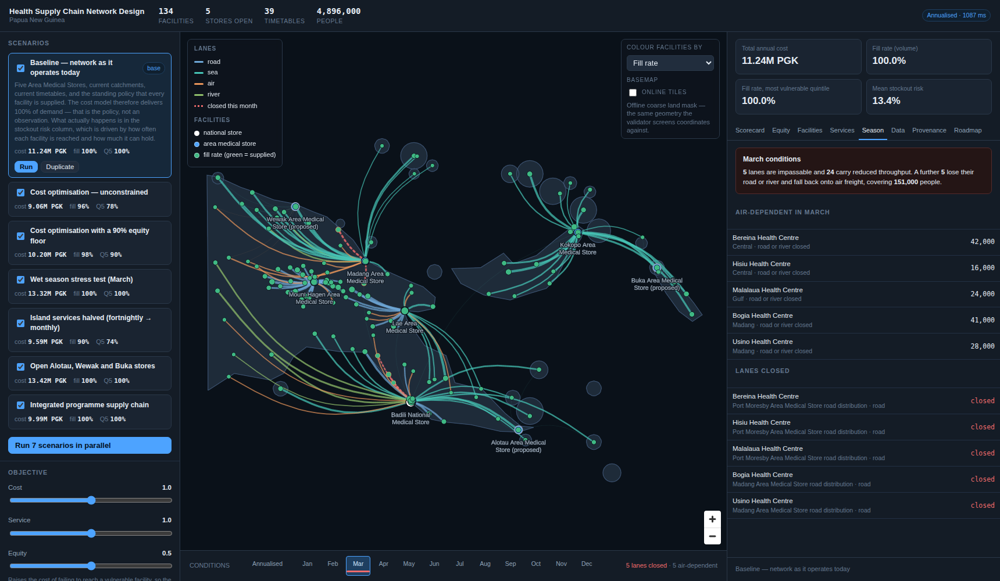

# Health Supply Chain Network Design

> A living digital twin of a national health supply chain that models sea, air and
> seasonal road access as first-class realities, scores every scenario on cost *and*
> equity, and stays with the government after the consultant leaves.

This is the MVP described in `competitive_specs_and_mvp.md` — Phase 1 and Phase 2 in
full, plus the Phase 3 capabilities the four demo moments depend on (equity objectives
and the costed roadmap generator).



---

## Run it

**Requires Python 3.9 or newer** — including the `python3` that ships with macOS, so
there is nothing to install first. Node is optional too: a built frontend is committed,
so the API serves the whole application on its own.

```bash
make install
make run
```

`make run` starts the server and keeps running in that terminal — leave it alone and
open <http://localhost:8000> in a browser. Ctrl+C stops it. If something already owns
that port, use `make run PORT=8080`.

On first start the backend creates a SQLite database,
seeds the Papua New Guinea reference workspace and solves the baseline, so the map has
data on it before you touch anything.

If you want to change the interface, install Node and use `make dev`, which rebuilds
the frontend from source first. `make backend` and `make frontend` give you the API and
the Vite dev server separately, with hot reload on both.

```bash
make test    # 288 tests
make a11y    # accessibility audit against the running app (needs Node)
make board   # plain-language build board, on http://localhost:4321
```

**`npm: command not found` is expected** and not a problem. The committed build means
`make run` works without Node. Install it (`brew install node`) only if you want to
edit the interface.

Both floors are deliberate. Requiring a Node toolchain and a newer Python to see a map
would contradict the durability claim the product is sold on, so the code is written to
run on a stock macOS install: `Optional[X]` rather than `X | None`, no dataclass slots.
The suite is run against 3.9 as well as 3.11.

---

## The four demo moments

The build plan says to write the demo script before writing code, so the application
is built backwards from it. All four work against the seeded dataset.

**1. "That's actually our country."** The map opens on 134 real facilities across 22
provinces, the five Area Medical Stores, and every lane that reaches them. It is the
highest-value thing in the demo because everyone in the room immediately starts
correcting it, and that engagement is the sale. The validator exists so the map is
never wrong in the way that makes an engagement unrecoverable — see *Validation*
below.

**2. "The boat only goes on Tuesdays."** Open the *Timetables* section in the left
panel and change the Milne Bay island run from weekly to monthly. Re-run. Cost falls,
and stockout risk at the island facilities climbs from near zero to near certain.
Nothing else in the network moves. No competitor reviewed in the spec sheets can show
this.

**3. "What happens in the wet season?"** Move the month slider under the map. The
scenario re-solves on every move — if the map showed February's closed roads while
the scorecard still showed the annual cost, the two would be read together and
mislead. On the seeded network the baseline runs:

| Conditions | Annual cost | Fill rate | Q5 fill | Facilities unreachable |
|---|---|---|---|---|
| Annualised | 11.24M | 100% | 100% | 0 |
| February | 15.27M (+35.8%) | 87.9% | 66.3% | 19 |
| March | 13.32M (+18.5%) | 100% | 100% | 0 |
| July | 10.99M (−2.3%) | 97.3% | 94.3% | 0 |
| September | 11.01M (−2.1%) | 99.7% | 99.4% | 0 |

March is the interesting one: everyone is still reached, and it costs 18.5% more to
do it, because five road and river lanes have closed and the traffic has gone onto
air charter. July is the second interesting one — calm on land, rough at sea, and the
southeast trades take enough maritime capacity out that the network cannot quite
deliver everything.

**4. "Who pays for the savings?"** Run *Cost optimisation — unconstrained*. It saves
**19.5%**. Open the equity panel:

> **This saving is being funded by the most vulnerable quintile.** Total cost moves
> −19.5% against the baseline, and the fill rate for the most vulnerable fifth of the
> population moves −22.3 points. On these figures 217,480 people move from supplied to
> not supplied.

Then run *Cost optimisation with a 90% equity floor*. The saving falls to **9.3%** and
the bottom quintile holds at 90%. That difference is the price of not funding the
saving out of the hardest-to-reach fifth of the population, and it is a decision for
the ministry, not for the model.

---

## What the model does

### Equity is an objective, not a report

Equity enters the model in three places, none of them cosmetic.

A **vulnerability index** is computed per facility from network structure alone —
remoteness, terrain, months of restricted access, and transport-mode dependency. It
is deliberately structural so that it is known before any optimisation runs and cannot
be gamed by the solution it is used to judge.

Facilities are then sorted into **population-weighted quintiles**: each band is a
fifth of the *people*, not a fifth of the buildings.

Finally, equity acts on the solution two ways. The **equity weight** scales the penalty
for failing to supply a facility by its vulnerability, so the solver protects a remote
facility before it protects a cheap one. The **equity floor** is a hard linear
constraint that every quintile must reach a minimum fill rate.

On the seeded network, reaching the most vulnerable quintile costs 4.24 PGK per person
per year against 1.48 for the least vulnerable — and when the unconstrained
optimisation drops that quintile to 78% fill, its cost per head falls to 1.79. The
saving and the abandonment are the same number seen from two sides.

### Scheduled services, and why a boat is not a road

A road lane is on demand: if a truck is full you send another truck. A vessel on a run
has a hold and a timetable, and if you miss it the next one is a fortnight away. The
model distinguishes them:

* **Liner** services carry `capacity_per_trip_m3` and are capacity-constrained. A
  vessel's hold is apportioned across the facilities on its run by demand share, and
  the trip cost is computed once over the whole loop and expressed as a freight rate
  per cubic metre — so no facility is charged for a return journey the boat did not
  make on its behalf.
* **Charter** services carry a quoted `cost_per_m3` and no fixed hold, because if you
  need more space you buy another flight. Their binding constraint is money.

Both have a **frequency**, because how often a service calls drives stockout risk
whether or not its hold is the binding constraint.

Stockout risk is a newsvendor-style approximation, simple on purpose: it has to be
defensible to a technical reviewer in one paragraph and respond instantly to a slider.
A facility is resupplied every *I* days, holds what its shelves and cold chain allow,
faces uncertain demand, and is served by a service that does not always sail — when it
misses, the interval is really 2*I*. Risk is the probability that consumption before
the next delivery exceeds what could be held after the last one.

The mechanism that makes this bite is **storage**, and remote facilities have less of
it, not more. On the seeded network an island health centre holding 24 days of cover
goes from roughly 1% stockout risk on a weekly boat, to 20% on a fortnightly one, to
near-certainty on a monthly one. Full discrete-event simulation of queues, wastage and
expiry is deferred to the SimPy layer, as the build plan says it should be.

### Seasonality is a lookup, not a feature

`Edge.monthly_access` is a 12-element vector on every lane, with a matching
`monthly_cost_multiplier`. Because it lives on every edge, seasonality did not have to
be bolted on — the month slider *is* that vector. Named profiles
(`highlands_unsealed`, `lowland_floodplain`, `sea_exposed`, …) let a country describe a
lane in one cell instead of twelve.

### The distance cascade

Every distance is produced by exactly one of four methods, and the method travels with
the number for the rest of its life:

| Method | Source | Confidence |
|---|---|---|
| `manual` | a human typed it, usually after a field interview | 0.95 |
| `osrm` | routed on a self-hosted OSRM graph | 0.85 |
| `detour_factor` | great circle inflated by a terrain-specific factor | 0.45–0.60 |
| `great_circle` | straight line, only ever correct for air | 0.90 (air) |

This is not bookkeeping. In a validation workshop a provincial health manager will say
"that road takes six hours, not two", and you need to be able to answer "that came
from a 1.6× detour factor on a 90 km straight line, so let's overwrite it" — and then
actually overwrite it, from the UI, with the old value and the reason preserved. The
*Provenance* tab shows the distribution of methods, the distance-weighted confidence
of the whole network, and the longest low-confidence lanes to replace first.

Set `HSCN_OSRM_URL` to point at a self-hosted OSRM instance and road lanes route
against it instead. Self-hosted per region on purpose: OSM coverage in the Pacific is
thin and the graph has to be patched with field-collected roads, which a hosted API
will not let you do.

### The solver

An allocation MILP on **HiGHS**: hubs open or closed as binaries, hub-to-facility flows
continuous, unmet demand explicit and priced. Continuous flows rather than binary
single-sourcing because at national scale the binary version is an order of magnitude
harder for a difference no minister can see. HiGHS because it is MIT licensed, and
commercial solver licensing per country would destroy the unit economics of a
multi-country platform. Runs take 40–500 ms on the seeded network, which is what makes
the month slider re-solve on every move.

**"Infeasible" is a useless answer in a workshop.** When an equity floor or a budget
cannot be met, the model re-solves as a maximin problem and reports the ceiling
instead: *"An 85% floor is not reachable in March; 61% is, and here is what it costs."*

The baseline expresses the standing policy that every facility is supplied as a
**price** — 6,000 PGK per cubic metre not delivered, above the most expensive air
charter in the network — rather than as a hard 100% constraint. That is why every
position of the month slider returns an answer: a bad month degrades into a legible
result naming the affected facilities, instead of a refusal.

### Validation

Garbage-in is the sector's defining problem, so the validator is the product, not
plumbing. Two rules govern every message:

1. **Say what is wrong in the language of the person who owns the data.** Not
   "constraint violation on node.lat", but *"Kupiano Health Centre plots 46 km offshore
   in the Coral Sea. Check the longitude."*
2. **Say what to do about it.** Every issue carries a suggestion; a test asserts it.

It catches facilities in open water, swapped latitude and longitude (with the corrected
values in the suggestion), null island, whole-degree placeholder coordinates, facilities
far from the centre of their own stated province, duplicate coordinates, vessels with
neither a hold nor a freight rate, access vectors entered as percentages, demand against
unknown facilities, negative consumption, and facilities that have demand but no lane
reaching them.

The offshore check uses a coarse land mask — big landmasses as polygons, small islands
as circular buffers — and reports itself as coarse. It is a screening test with a
generous tolerance, not a coastline: its job is to catch errors of hundreds of
kilometres, which is the error class that actually occurs in master lists. The same
geometry is what the map draws as its offline basemap, so what you see is exactly what
the validator believes.

### Live LMIS integration

Connectors for **DHIS2**, **OpenLMIS v3** and **Open mSupply**, plus the Excel path,
which remains first-class rather than a fallback.

The design decision that matters is that a live pull earns **no privileges**. A
connector's only job is to turn a remote system's response into the same record shape
the Excel importer produces; from there it goes through the identical validator, the
identical reconciliation and the identical commit. A facility pulled from a ministry's
own DHIS2 with its coordinate in the Bismarck Sea is caught by exactly the check that
catches it in a spreadsheet, and a test asserts precisely that.

**Nothing is written until somebody has looked.** The sequence is *test* → *preview* →
*apply*, and there is no button that reaches out and rewrites a national facility list.
The test reports each step separately, because "connection failed" cannot be acted on
and "authenticated, but this account cannot read organisation units" can. The preview
reconciles against what is already loaded and reports what would change:

> 6 facilities matched, 1 are new, 128 in the model were not in this pull, 1 would move
> more than 2 km, 1 would be renamed.

Matching runs in order of how much an identifier is worth: the system's own key first
(a stored DHIS2 UID is proof), then facility code, then any shared external identifier,
then name *and* proximity — never name alone. The source key is written back on commit,
so a facility that gets recoded upstream still matches next time. Name normalisation is
deliberately conservative: "Kerema General Hospital" and "Kerema Hospital" are the same
place, but "Tabubil Hospital" and "Tabubil Rural Clinic" are not, and silently merging
them would lose a facility from a national list.

**No connector returns transport lanes, and applying a sync never touches them.** No
logistics system knows which boat calls at Losuia on which day. A sync that dropped the
timetables because DHIS2 has no view of them would delete the part of the model that
took a fortnight of interviews to assemble.

Two further consequences of that principle, both tested:

* **Merge, not replace.** Demand is replaced only for the facility-and-product pairs the
  pull actually supplied, so a sync covering two products does not wipe the other six.
* **The validator knows the difference between a complete dataset and a partial update.**
  A workbook is the whole model, so a facility nothing can reach is an error. A sync is
  facilities and consumption only, so the same rule would reject a national facility list
  for not containing boat timetables. Checks that judge a record on its own merits are
  not relaxed at all.

**Configuration, not code.** Endpoints, DHIS2 field selectors, GraphQL documents, facility
levels and the data-element-to-SKU mapping are all settings on the connection, editable
from the UI. A DHIS2 2.36 instance and a 2.41 instance disagree about details; a country
should fix that in a form field during the workshop, not wait for a release.

**Credentials** belong in an environment variable (`secret_env`), which keeps them out of
the database and out of any backup of it. Storing one directly is supported and labelled
as a convenience for a laptop during a workshop. No endpoint ever returns a credential.

#### What is not yet true

Every connector reports `verified_against_live_instance: false`, and the UI says so on
the connection page. The endpoints follow each system's published API and are exercised
against mock servers reproducing their real payload shapes — DHIS2's `pager` blocks,
both of its coordinate representations, its headers-and-rows analytics table; OpenLMIS's
separate client credential and Spring-style paging; GraphQL answering 200 with an
`errors` array. The DHIS2 connector is additionally driven over real HTTP end to end.
But nobody has pointed one at a ministry's own server, and that is the first Sprint 0
task for any country.

**Legacy mSupply — which is what PNG runs — has no such API.** The connector speaks Open
mSupply's GraphQL, and says plainly in its own connection test that the legacy product
does not expose it and that the realistic paths are a scheduled export through the Excel
importer or a feed agreed with Beyond Essential Systems. Being caught overstating this
in front of MSPDB would cost more than the integration is worth.

### Excel round trip

The export and the blank template have identical columns, so whatever comes out can go
back in. A test round-trips the entire seeded network through the exporter and the
importer and asserts that the result still passes validation.

This is not a convenience feature. RoOT's adoption in Mozambique is the evidence: an
Excel front end is why logisticians actually used it. A country that cannot get its
model out of the tool has not been handed anything, and the durability claim the whole
product is sold on is empty.

### The costed roadmap

The terms of reference ask for a costed roadmap. If the tool does not generate it, the
expert writes it by hand and the tool is decoration. So the roadmap is derived
mechanically from the difference between two scenarios — hubs opened and closed,
catchments reassigned, timetables changed, policy levers moved — with each step
phased, costed, assigned an owner, and carrying the evidence for why it is in the list.
The expert then edits it. That is the right division of labour: the model owns
arithmetic and consistency, the expert owns judgement and sequencing.

Capital cost never enters the annual comparison. A hub's build cost appears at full
value in the roadmap and as a ten-year amortised charge in the operating figures, so a
scenario that opens three stores is not made to look 4.5M PGK worse *per year* than it
is.

---

## The Papua New Guinea dataset

**Real:** every facility location — 134 towns, stations and hospitals, accurate to the
settlement — with real provinces and districts. The network structure is real: five
Area Medical Stores, **no road link between Port Moresby and the rest of the country**,
the Highlands Highway out of Lae, coastal shipping to the islands, air charter to the
interior. That single road fact shapes the entire model.

**Illustrative:** demand, storage capacity, costs, and every vessel and aircraft
schedule. Demand is derived from catchment population and a per-1,000 consumption rate
per product — the same proxy-indicator strategy SCANIT uses, and a good one, but every
row is marked `proxy` and the application says so on every screen that shows it.

Replace with the NDoH facility master list, mSupply consumption data, the national cold
chain inventory, and the real coastal shipping and air charter timetables. Whether
those timetables exist in digitised form is the single most important open question
about this dataset: it decides whether the signature capability has any data behind it.

Every assumption is written to the audit trail at seed time and shown in the
*Provenance* tab with an `[S]` / `[I]` / `[U]` confidence marker.

---

## Architecture

```
React 19 + MapLibre GL          map, scenario levers, scorecard, equity panel
        │  REST
FastAPI │  ingest · validate · network · scenario · results · exports
        │
Engine  │  distance cascade · seasonality · scheduled services · costing
        │  equity · allocation MILP (HiGHS) · KPIs · roadmap
        │
SQLAlchemy → SQLite by default, PostGIS via DATABASE_URL
```

Deliberately runnable with no infrastructure: SQLite on disk, threads for parallel
scenario runs, an offline basemap. The production path — PostGIS, Celery workers,
self-hosted OSRM, S3 — swaps in behind the same interfaces, and the seams are marked
in the code where they are. Nothing here has to be rewritten to get there; the
scenario-set endpoint that runs seven solves in parallel is the same call whether the
workers are threads or Celery.

Three schema decisions are load-bearing and were made once, up front, because
retrofitting them after country #2 would be a rewrite:

1. **`Node.level` is an integer, not an enum.** "AMS" is a label in the PNG country
   config. Country two will have four tiers, or six.
2. **Every distance carries its method and confidence**, and can be overridden from
   the UI rather than from a database console.
3. **`Edge.monthly_access` is a 12-element vector on every edge.** This is what makes
   seasonality free rather than a bolt-on.

### The build board

`make board` opens a read-only page listing every user story in the project, in plain
language, across five columns: raised, being planned, being written, being checked, and
finished. It is a reverse issue tracker — nothing is written up front, the record is
compiled as the work happens.

Two facts are tracked per story and never conflated: **how far it has got** and **where
it actually runs**. A story is routinely finished and not deployed, and that gap is the
most useful column on the board. As of now this project has 37 stories: none in
production, 26 finished but not deployed anywhere, 3 in flight, 8 not started.

It renders `build-status.json` in the repository root — plain, readable, committed JSON
that you own, re-read every two seconds. Delete the page and the record survives; it is
a view, not the source of truth.

There is also a parking lot for the things that were discussed and never built, with the
reason attached — which is otherwise the first thing anyone forgets.

The board is deliberately read-only. Approvals happen in conversation, and nothing is
deployed while something is waiting on you. The skill that keeps the file updated is
vendored in `.claude/skills/build-companion/`.

### Interface

The interface is audited against the `ui-ux-pro-max` design skill vendored in
`.claude/skills/`, which is roughly 250 rules citing Apple's Human Interface Guidelines,
Material Design and WCAG. `docs/design-audit.md` records what complied, what was fixed
and what was deliberately left alone.

The audit is executable, not a claim: `make a11y` runs axe-core over all nine tabs of the
running app and then checks the things axe cannot see — that the skip link is really the
first tab stop, that the tablist answers arrow keys, that a month can be chosen without a
mouse, that focus draws a visible ring, that no viewport from 1440px down to 768px
produces horizontal page scroll, and that every target is thumb-sized under a coarse
pointer. Twenty-three checks; it exits non-zero on any failure.

### Configuration

| Variable | Default | Purpose |
|---|---|---|
| `HSCN_DATABASE_URL` | `sqlite:///backend/var/hscn.db` | PostGIS in production |
| `HSCN_OSRM_URL` | unset | Self-hosted OSRM for road routing |
| `HSCN_SEED_ON_STARTUP` | `true` | Seed the PNG workspace on first run |
| `HSCN_CORS_ORIGINS` | `localhost:5173` | Vite dev server |

---

## Deliberately not built

Following the build plan's "resist these" list: no full stochastic discrete-event
simulation (deterministic scenario comparison is enough for the first engagement, and
DES demos poorly), no vehicle routing (strategic design first — RoOT already does
last-mile for free), no multi-user real-time collaboration (one analyst and one expert
is the real usage pattern for eighteen months), no mobile app, no agentic model
building, and no inventory optimisation.

## Limits worth stating plainly

* The land mask is coarse. It screens for errors of tens of kilometres and up, and says
  so; it is not a coastline.
* Allocation is single-echelon. The primary leg from the national store to each hub is
  costed along the cheapest upstream chain and added to every outbound lane, rather
  than given its own flow variables. Flow conservation at the hub is handled by the
  throughput constraint. This is accurate for cost and correct for capacity, but it
  will not model a hub-to-hub transhipment decision.
* A month-specific run answers "what would a year cost and reach if this month's
  conditions held all year?". It is not a monthly budget. The UI labels it as such.
* Stockout risk is analytic, not simulated. It responds correctly to frequency,
  storage, reliability and season, but it does not model wastage, expiry or queueing.
